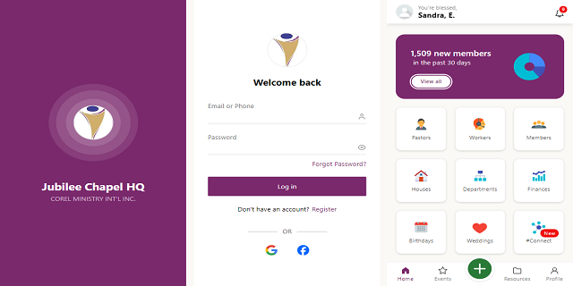

# CRESPO

Internal Database Web App - Corel Ministry Int'l

[](https://legacy.reactjs.org/docs/getting-started.html)
[](https://www.typescriptlang.org/docs/)
[](hhttps://console.firebase.google.com/)

## Installation

```
$ git clone https://github.com/2gbeh/crespo.git

$ cd crespo

$ npm install

$ npm run dev
```

## Usage

> Local:   http://localhost:5173/

## Documentation


